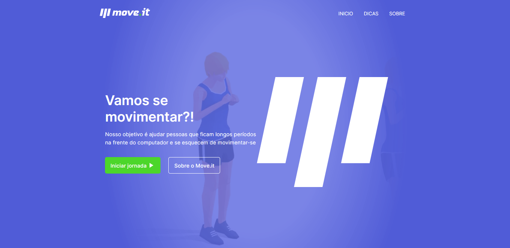
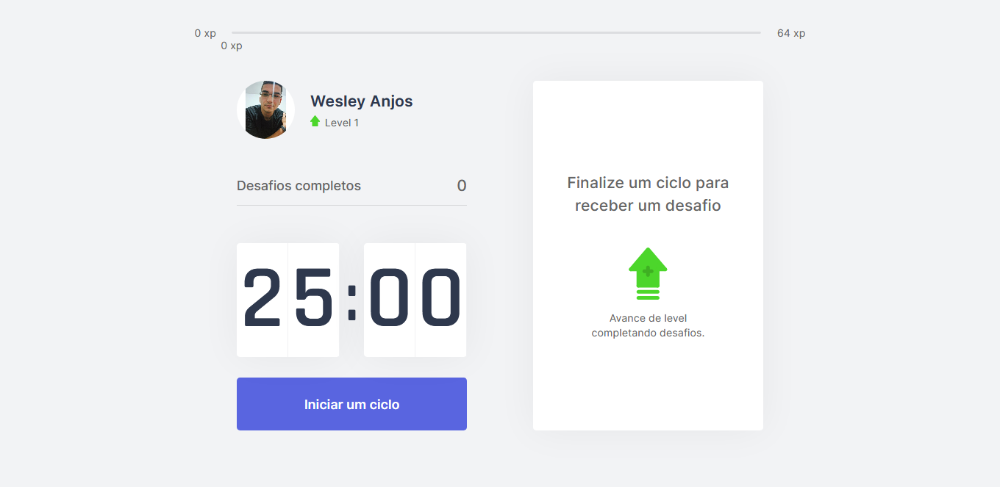

<h1 align="center">
  
</h1>

### :rocket: Sobre o Projeto
Moveit tem como objetivo ajudar pessoas que ficam muito tempo na frente do computador e se esquecem de movimentar-se.
Projeto desenvolvimento durante Next Level Week #04 da Trilha ReactJS fornecida pela Rocketseat

## 🧪 Tecnologias 
- [Next.js](https://nextjs.org/)
- [React](https://reactjs.org)
- [TypeScript](https://www.typescriptlang.org/)

## :eyes: Preview
<h1 align="center">
  
  
</h1>

[](https://move-it-ruby-one.vercel.app/)

## ⚡ Como rodar este projeto
Necessário ter o [Git](https://git-scm.com/) e [Node.js](https://nodejs.org/en/) instalado em sua máquina. Após a instalação, rodar os seguintes comandos:

```bash

## Clone este projeto
$ git clone https://github.com/SrWess/MoveIt

## Acessa a pasta do projeto 
$ cd MoveIt

## Intale as dependências
$ yarn install

## Executa aplicação como desenvolvimento
$ yarn dev

## Servidor será iniciado no seguinte endereço: http://localhost:3000

```

### Licença
Projeto está sobre a licença MIT. Veja a [LICENÇA](https://github.com/SrWess/MoveIt/blob/main/LICENSE) para mais informações.